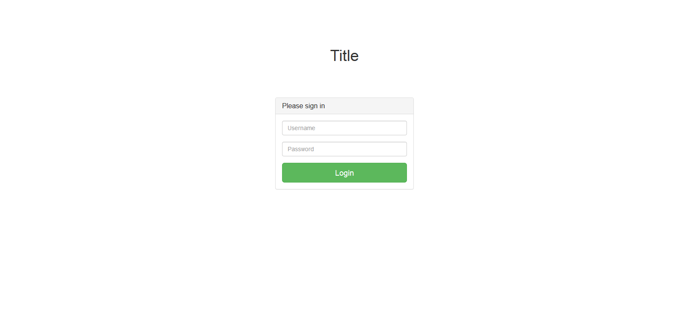

# python-web app-template
A template python web app that includes common web pages. Will be continuously updated.

## Requirements

Written for Python 3 with minimal dependencies (in `requirements.txt`):

* Flask
* (optional - for login) flask-login
* (Optional - for image upload) pillow
* (Optional - for chat) watson_developer_cloud

## UI

UI content inlcudes:

 * Login
 * Chat
 * Simple Input
 * Image Upload
 
You can remove the UI pages you don't need by removing their relevant files in `templates/`, `static/stylesheets/`, and `static/javascript`. 

## Web app

* `app.py` contains the Flask server.
* `functions/` contains utilities and functionalities, this is to be used to avoid cluttering the main app file. 
* The different UI routes (and their relevant methods) are sectioned in `app.py`. You can remove any sections which you don't need.
* APIs: APIs sample is implimented in `/api/...` route, modify te content and/or route name in `app.py ` as per your needs. There is more than one route to handle a GET request and more than one route for POST requests. The POST request handles image upload through forms and chat messages.
* Chat: impliment the chat functionality in the `api/message` route in `app.py`. See [Watson Assistant](### Watson Assistant) below for more information.

### Watson Assistant

To use the conversation service (Watson Assistant), you need to put in your credentials in `vcap-local.json`, which you can obtain from [IBM Cloud](console.bluemix.net). In `app.py`, use the [Watson Assistant](https://www.ibm.com/watson/services/conversation/) sections to handle the conversation or replace with your own methods for handling. In `chat.js`, `sendRequest(message)` handles sending the post request to server. The `req` object  can be extended to pass additional information back back to the server; on the server, this information is to be handled in the `message()` function in a similar manner to `msg`.  

## Cloud Foundry

The application is CF ready, just type `cf push app-name` after logging in on the cf command line and it should push. 
